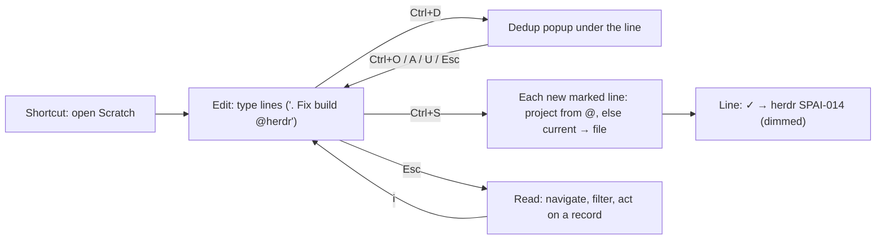

# Plan: Scratchpad - a new fullscreen modal mode in pi-herdr-sidebar

## Goal
Open a **fullscreen modal** with a shortcut and just type free text. A line carrying a SPAI mark (`. / x ? - # * % ;`) becomes a record and a **physical file** in the `docs/spai` folder of the project cited with `@project`, on **Ctrl+S**. With no `@`, the record goes to the current project. Two modes (Edit / Read), three scopes (New / Project / All), filters in Read mode (fuzzy, semantic), and a saved line is visibly distinct.

## What already exists (not reinvented)
| Need | Source in your code |
|---|---|
| Edit/Read modes, the record as the unit | `piprompt-core` (`app/readmode.rs`, `slices/spai/record.rs`) - **a model only**, the sidebar does not depend on it |
| SPAI marks, type detection | sidebar `input_highlighter::detect_spai_input`, `type_options` |
| `@project` completion | `spai_notes/autocomplete.rs` |
| Writing a record file | `format_spai_markdown`, `create_quick_note_with_status` |
| Dedup (text + vector) | `similarity.rs`, `state_similar_actions.rs`, `settings::vector_service` |
| Words from project documents | **out of scope** (slows things down) |

> [!IMPORTANT]
> `piprompt` only saves a single `draft.md`; it does not write record files into projects. That is exactly the new feature, and it belongs in the sidebar, where file writing, vectors and OpenRouter already live.

## Decisions (from your answers)
- A new **fullscreen modal window** in `pi-herdr-sidebar`, opened by a shortcut.
- Scopes: **New** (new lines only) · **Project** (records of the current project loaded as lines) · **All** (records of all projects).
- **Ctrl+S** saves records; **Ctrl+D** runs dedup on demand; the result is a modal window **under the line being created**.
- A saved line stays in place, shown **dimmed/italic** with a label `✓ → project SPAI-014`; in Read mode it can be opened.

## User flow


## Design

### Architecture (VSA)
A slice **must not import other slices**, so the new code lives inside the existing `spai_notes` slice as a submodule `spai_notes/scratch/` (sharing `note`, `storage_format`, `discovery`, `similarity`). It is wired in `view/keys` and `view/ui` the same way the current dialogs are. Files stay under 300 lines.

```
spai_notes/scratch/
  mod.rs          exports, ScratchState
  state.rs        mode, scope, buffer, cursor, dirty
  line_model.rs   Line { text, origin: New | Saved{path,id,project} }
  scope.rs        loading lines for New/Project/All
  save.rs         Ctrl+S pipeline (routing, write, switch line to Saved)
  dedup.rs        Ctrl+D, popup state, per-line results
  filter.rs       filter parser + fuzzy + semantic
  edit_keys.rs    Edit mode
  read_keys.rs    Read mode
  draft.rs        autosave of unsaved lines
  view.rs / view_lines.rs / view_footer.rs / dedup_popup.rs
```

### 1. Writing (Edit mode)
- Full area, one buffer, **one line = one record** (continuation lines without a mark belong to the previous record, the same rule as piprompt's `record_at`).
- Existing highlighting and `@project` completion are reused (`highlight_spai_input_spans`, `autocomplete`).
- Footer: mode `-- EDIT --`, keys, **hint for the type of the current line only** (from `SPAI_TYPE_OPTIONS`) and `→ target project` derived from `@` (live routing preview).
- A prose line without a mark is not saved; it stays in the scratchpad as plain text with no label.

### 2. Ctrl+S - saving to files
For every new line with a mark:
1. **Project**: the first `@mention` that matches a project (name or path); otherwise the current project; otherwise the line stays and an error is shown (nothing is lost).
2. **ID**: `max(number in docs/spai) + 1`, read from disk; the file is created with `create_new`, retrying on collision (the fix from the review, otherwise files could be overwritten).
3. **Write**: `format_spai_markdown` into `docs/spai`, atomically (`.tmp` + rename); the directory is created if missing.
4. The line switches to `Saved{path,id,project}` and is no longer editable in the buffer (changes only via Read actions / the Notes editor), so text and file cannot diverge.
5. Summary in the footer: `Saved 3 · herdr SPAI-014, SPAI-015 · pi-spai SPAI-022`. A failure on one line does not block the others.
6. **Undo of the last batch**: `u` in Read mode deletes the files created by the last Ctrl+S (paths are known); cheap and safe.

### 3. Ctrl+D - dedup on demand
- Only for the line under the cursor; **no automatic request** (no timer). Without an API key: local text match + stored vectors.
- The result is a modal window anchored **under the line** (similarity, ID, title). Inside: `↑/↓` select, `Ctrl+O` open, `Ctrl+A` append to the selected one, `Ctrl+U` change status, `Esc` close.
- Extract the logic from `state_similar_actions.rs` into functions with no tie to `creation_dialog` (input: text + project), so both dialogs share it.
- Ctrl+S never blocks. If a line has a fresh Ctrl+D result above the threshold, a footer warning `⚠ similar: SPAI-009` is shown (no prompt).

### 4. Read mode and filters
Navigation by records (not lines); `Esc` toggles Edit ↔ Read, `i` goes back, `q`/`Esc` closes (unsaved lines: ask first).

| Key in Read | Action |
|---|---|
| `↑/↓`, `j/k`, `g/G` | record up/down |
| `Tab` / `Shift+Tab` | scope New → Project → All |
| `Enter`, `o` | open the record (Notes editor) |
| `x`, `s` | done / cycle status (writes the file) |
| `/` | **fuzzy filter** (title, body, tags) |
| `~` | **semantic filter** (runs on `Enter`: one query embedding + cosine over stored vectors) |
| `f` / `F` | cycle status: open → all → done / clear filter |
| `u` | undo the last save batch |

Filters compose (AND), tokens in a single line: `/build @herdr :ui: !high` (fuzzy text, project, tag, priority). Fuzzy scoring is a small pure module `filter.rs` (subsequence score with a word-start bonus, Czech normalisation via the existing `normalize_czech`); the idea and tests are taken from `piprompt-core/fuzzy` (copied, no crate dependency; sharing can come later).

### 5. Scopes and performance
- **New**: empty buffer (+ restored draft).
- **Project**: `ensure_items()` for the current project only; line = `symbol id title`, newest first.
- **All**: lazily per project (existing `ensure_items`), rendering virtualised (visible window only), cache keyed by `file_fingerprint`; the filter runs over what is loaded.

### 6. Saved-line visuals
A trailing label `✓ → herdr SPAI-014` plus the whole line dimmed and italic (`Modifier::DIM | ITALIC`). Done (`x`) stays struck through as in the highlighter; `* % ;` are not struck through.

### 7. Draft and shortcut
- Unsaved lines are autosaved to `HERDR_PLUGIN_STATE_DIR/scratch-draft.md` (never the source tree) and restored on the next open.
- Shortcut: global `Ctrl+N` (unused in dialogs; `n` in Notes is separate). Additionally an action in `herdr-plugin.toml` so Herdr can bind a key. **Please confirm the key.**

### 8. Prerequisites from the review (phase 0)
Scratch relies on writing files, so first: (a) one prefix table that does not strip the first letter, (b) ID allocation from disk + `create_new`, (c) atomic write. Without them bulk saving would multiply the bugs.

## Phases
1. **Phase 0** - prefixes, IDs, atomic write, extract a shared `note_writer` (for the dialog and for scratch), extract the dedup functions.
2. **Phase 1** - Edit + Ctrl+S + `✓` label + draft.
3. **Phase 2** - Ctrl+D popup.
4. **Phase 3** - Read + scopes + fuzzy filter.
5. **Phase 4** - semantic filter, `u` (undo batch).

## Open questions (non-blocking, each has a default)
> [!NOTE]
> 1. `Ctrl+N` to open (will change on request).
> 2. Ctrl+S on a similar record: default = footer warning only, no confirmation. Want a confirmation prompt?
> 3. Prose lines without a mark: default = stay in the scratchpad, not saved. Or save them as a `-` note?
> 4. Editing a saved line: default = only via Read (`Enter` → editor). Allow editing directly in the buffer (risk: text vs. file drift)?

## Verification
- `cargo test`: `@project` routes to the right folder, fallback to current, unknown `@x` → line stays; ID uniqueness in a batch of 3 lines and after a delete; a partial failure does not destroy the rest; undo of a batch; fuzzy scoring and filter parser; Ctrl+D does not run without the shortcut; a Saved line is not editable; the draft is restored.
- `#[ignore]` dev-preview frames: empty Edit, a line with a type (footer), after save (`✓`), dedup popup under the line, Read with a filter, scope All.
- Live: close the pane, `cargo build --release`, `herdr pane read <id> --source visible`; check the files created in `docs/spai` of two projects.
- Commit + push in `plugins/pi-herdr-sidebar` after each phase.
