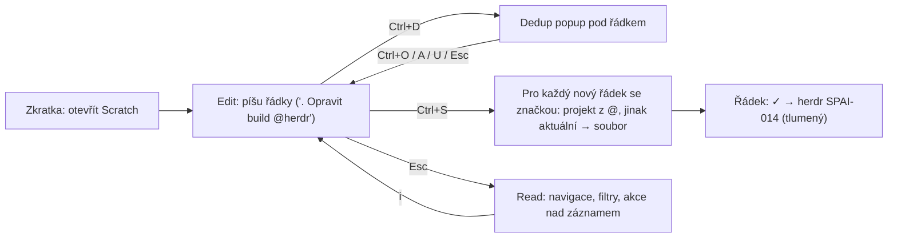

# Plán: Scratchpad – nový celoobrazovkový režim v pi-herdr-sidebar

## Cíl
Zkratkou otevřít **celoobrazovkový modál**, kam se píše volný text. Řádek se SPAI značkou (`. / x ? - # * % ;`) se po **Ctrl+S** stane záznamem a **fyzickým souborem** v `docs/spai` projektu, který řádek cituje přes `@projekt`. Bez `@` jde záznam do aktuálního projektu. Dva režimy (Edit / Read), tři rozsahy (Nový / Projekt / Vše), v Read filtry (fuzzy, sémantické), uložený řádek je vizuálně odlišen.

## Co už existuje (nevymýšlíme znovu)
| Potřeba | Zdroj ve vašem kódu |
|---|---|
| Edit/Read režimy, záznam jako jednotka | `piprompt-core` (`app/readmode.rs`, `slices/spai/record.rs`) – **jen vzor**, sidebar na něj nezávisí |
| SPAI značky, detekce typu | sidebar `input_highlighter::detect_spai_input`, `type_options` |
| `@projekt` dokončování | `spai_notes/autocomplete.rs` |
| Zápis souboru záznamu | `format_spai_markdown`, `create_quick_note_with_status` |
| Dedup (textový + vektorový) | `similarity.rs`, `state_similar_actions.rs`, `settings::vector_service` |
| Slova z dokumentů projektu | **vynecháno** (zpomaluje) |

> [!IMPORTANT]
> `piprompt` ukládá jen jeden `draft.md`, soubory záznamů do projektů nezapisuje. To je právě nová funkce a patří do sidebaru, kde už zápis, vektory i OpenRouter jsou.

## Rozhodnuto (z vašich odpovědí)
- Nové **modální celoobrazovkové okno** v `pi-herdr-sidebar`, vyvolané zkratkou.
- Rozsahy: **Nový** (jen nové řádky) · **Projekt** (načtou se záznamy aktuálního projektu jako řádky) · **Vše** (záznamy všech projektů).
- **Ctrl+S** ukládá záznamy; **Ctrl+D** spustí dedup na požadání; výsledek v modálním okně **pod vytvářeným řádkem**.
- Uložený řádek zůstane na místě, **tlumeně/kurzívou** se štítkem `✓ → projekt SPAI-014`, v Read režimu jde otevřít.

## Uživatelský tok


## Návrh

### Architektura (VSA)
Slice se **nesmí importovat jiné slice**, proto nový kód patří do existující slice `spai_notes` jako podmodul `spai_notes/scratch/` (sdílí `note`, `storage_format`, `discovery`, `similarity`). Napojení v `view/keys` a `view/ui` stejně jako dnešní dialogy. Soubory < 300 ř.

```
spai_notes/scratch/
  mod.rs          export, ScratchState
  state.rs        mode, scope, buffer, cursor, dirty
  line_model.rs   Line { text, origin: New | Saved{path,id,project} }
  scope.rs        načtení řádků pro Nový/Projekt/Vše
  save.rs         Ctrl+S pipeline (routing, zápis, přepnutí řádku na Saved)
  dedup.rs        Ctrl+D, popup state, výsledky per řádek
  filter.rs       parser filtru + fuzzy + sémantika
  edit_keys.rs    Edit režim
  read_keys.rs    Read režim
  draft.rs        autosave neuložených řádků
  view.rs / view_lines.rs / view_footer.rs / dedup_popup.rs
```

### 1. Zápis (Edit režim)
- Plná plocha, jeden buffer, **jeden řádek = jeden záznam** (pokračovací řádky bez značky patří k předchozímu záznamu, stejné pravidlo jako v piprompt `record_at`).
- Zvýraznění a `@projekt` dokončování existující (`highlight_spai_input_spans`, `autocomplete`).
- Patička: režim `-- EDIT --`, klávesy, a **nápověda jen k typu aktuálního řádku** (z `SPAI_TYPE_OPTIONS`) + `→ cílový projekt` odvozený z `@` (živý náhled routingu).
- Prózový řádek bez značky se neukládá, zůstane jako poznámka ve scratchi (beze štítku).

### 2. Ctrl+S – uložení do souborů
Pro každý nový řádek se značkou:
1. **Projekt**: první `@mention`, který odpovídá projektu (jméno nebo cesta); jinak aktuální projekt; jinak řádek zůstane a zobrazí se chyba (žádná ztráta).
2. **ID**: `max(číslo v docs/spai) + 1` čteno z disku, soubor přes `create_new` s opakováním při kolizi (oprava z review, jinak hrozí přepsání).
3. **Zápis**: `format_spai_markdown` do `docs/spai`, atomicky (`.tmp` + rename); adresář se vytvoří, pokud chybí.
4. Řádek se přepne na `Saved{path,id,project}` – nelze už editovat v bufferu (změna jen přes Read akce / Notes editor), takže se text a soubor nerozejdou.
5. Souhrn do patičky: `Uloženo 3 · herdr SPAI-014, SPAI-015 · pi-spai SPAI-022`. Chyba jednoho řádku neblokuje ostatní.
6. **Undo poslední dávky**: `u` v Read smaže soubory vzniklé poslední Ctrl+S (cesty známe), levný a bezpečný.

### 3. Ctrl+D – dedup na požadání
- Jen pro řádek pod kurzorem; **žádný automatický dotaz** (ani časovač). Bez API klíče lokální textová shoda + uložené vektory.
- Výsledek v modálním okně ukotveném **pod řádkem** (podobnost, ID, název). Uvnitř: `↑/↓` výběr, `Ctrl+O` otevřít, `Ctrl+A` připojit k vybranému, `Ctrl+U` změnit stav, `Esc` zavřít.
- Logiku z `state_similar_actions.rs` vytáhnout do funkcí bez vazby na `creation_dialog` (vstup: text + projekt), ať ji používají oba dialogy.
- Ctrl+S nikdy neblokuje. Pokud má řádek čerstvý výsledek Ctrl+D nad prahem, zobrazí se v patičce upozornění `⚠ podobné: SPAI-009` (bez dotazu).

### 4. Read režim a filtry
Navigace po záznamech (ne po řádcích), `Esc` přepíná Edit ↔ Read, `i` zpět, `q`/`Esc` zavře (neuložené řádky: dotaz).

| Klávesa v Read | Akce |
|---|---|
| `↑/↓`, `j/k`, `g/G` | záznam nahoru/dolů |
| `Tab` / `Shift+Tab` | rozsah Nový → Projekt → Vše |
| `Enter`, `o` | otevřít záznam (Notes editor) |
| `x`, `s` | hotovo / cyklus stavu (zápis do souboru) |
| `/` | **fuzzy filtr** (název, tělo, tagy) |
| `~` | **sémantický filtr** (spustí se `Enter`, jeden embedding dotazu + cosine nad uloženými vektory) |
| `f` / `F` | cyklus stavů: otevřené → vše → hotové / zrušit filtr |
| `u` | vrátit poslední dávku uložení |

Filtr je skládací (AND), tokeny v jednom řádku: `/build @herdr :ui: !vysoká` (fuzzy text, projekt, tag, priorita). Fuzzy skórování: malý čistý modul `filter.rs` (subsequence skóre s bonusem za začátek slova, normalizace češtiny existující `normalize_czech`); nápad i testy převzaté z `piprompt-core/fuzzy` (zkopírováno, bez závislosti na crate – případné sdílení později).

### 5. Rozsahy a výkon
- **Nový**: prázdný buffer (+ obnovený draft).
- **Projekt**: `ensure_items()` jen aktuálního projektu; řádek = `symbol id název` seřazené od nejnovějších.
- **Vše**: líně po projektech (existující `ensure_items`), vykreslení virtualizované (jen viditelná okna), cache dle `file_fingerprint`; filtr běží nad načteným.

### 6. Vizuál uloženého řádku
`✓ → herdr SPAI-014` jako štítek na konci řádku + řádek tlumený a kurzívou (`Modifier::DIM | ITALIC`). Hotové (`x`) přeškrtnuté jako dnes v highlighteru; `* % ;` nepřeškrtávat.

### 7. Draft a zkratka
- Neuložené řádky se autosavují do `HERDR_PLUGIN_STATE_DIR/scratch-draft.md` (ne do zdrojového stromu), obnoví se při příštím otevření.
- Zkratka: globální `Ctrl+N` (v dialogu nepoužito, v Notes `n` je jiné). Doplňkově akce v `herdr-plugin.toml` pro klávesovou vazbu z Herdru. **Potvrďte klávesu.**

### 8. Předpoklady z review (fáze 0)
Scratch stojí na zápisu souborů, proto nejdřív: (a) jedna tabulka prefixů bez ořezávání prvního písmene, (b) alokace ID z disku + `create_new`, (c) atomický zápis. Bez nich by hromadné ukládání z řádků násobilo chyby.

## Fáze
1. **Fáze 0** – prefixy, ID, atomický zápis, extrakce `note_writer` (společný pro dialog i scratch), extrakce dedup funkcí.
2. **Fáze 1** – Edit + Ctrl+S + štítek `✓` + draft.
3. **Fáze 2** – Ctrl+D popup.
4. **Fáze 3** – Read + rozsahy + fuzzy filtr.
5. **Fáze 4** – sémantický filtr, `u` (undo dávky).

## Otevřené otázky (neblokující, mají výchozí volbu)
> [!NOTE]
> 1. Klávesa `Ctrl+N` pro otevření (změním na požádání).
> 2. Ctrl+S při podobném záznamu: výchozí = jen upozornění v patičce, neblokuje. Chcete potvrzovací dotaz?
> 3. Prózové řádky bez značky: výchozí = zůstanou ve scratchi, neukládají se. Nebo je ukládat jako `-` poznámku?
> 4. Editace uloženého řádku: výchozí = jen přes Read (`Enter` → editor). Povolit editaci přímo v bufferu (hrozí rozdíl text vs. soubor)?

## Verifikace
- `cargo test`: routing `@projekt` → správná složka, fallback na aktuální, neznámý `@x` → řádek zůstane; unikátnost ID při dávce 3 řádků a po smazání; částečná chyba nezničí ostatní; undo dávky; fuzzy skóre a parser filtru; Ctrl+D neběží bez zkratky; Saved řádek není editovatelný; draft se obnoví.
- `#[ignore]` dev‑preview snímky: prázdný Edit, řádek s typem (patička), po uložení (`✓`), dedup popup pod řádkem, Read s filtrem, rozsah Vše.
- Živě: zavřít pane, `cargo build --release`, `herdr pane read <id> --source visible`; kontrola vzniklých souborů v `docs/spai` dvou projektů.
- Commit + push v `plugins/pi-herdr-sidebar` po každé fázi.
